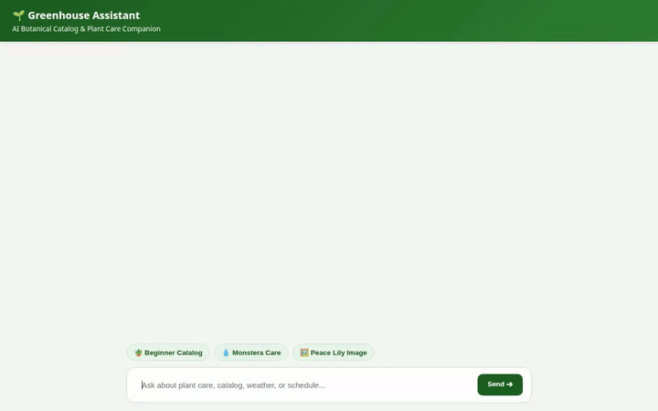

# 🌱 Greenhouse Assistant

> An AI-powered botanical catalog, plant-care advisor, and media generator built with the **Google Agent Development Kit (ADK)** and deployed on **Agent Platform**.



---

## 🌟 Overview

**Greenhouse Assistant** is an intelligent conversational agent that helps plant enthusiasts identify species, research herbal remedies, check local care conditions, manage indoor plant inventories, and generate custom botanical visual assets.

---

## 🛠️ Integrated Tools & Google Cloud Services

The project integrates the following features and Google Cloud services:

* **🧠 Vertex AI Memory Bank**: Preserves user preferences, indoor plant notes, and care history across multi-session conversations.
* **🔥 Google Cloud Firestore**: Persistent database storage for plant catalog inventory management and watering schedule tasks.
* **☁️ Google Cloud Storage (GCS)**: Direct in-memory upload and hosting for plant image and video assets.
* **📚 Vertex AI RAG Engine**: Retrieval-Augmented Generation grounded on Nicholas Culpeper's *The Complete Herbal* ebook.
* **🎨 Image Generation**: Generates high-quality plant photos using `gemini-3.1-flash-lite-image`.
* **🎬 Video Generation**: Produces short plant movement videos using Google's Omni model (`gemini-omni-flash-preview`) in the `global` region.
* **🗺️ Google Maps & Places APIs**: Address geocoding and physical nursery/plant shop discovery.
* **🌿 Botanical Taxonomy Registries**: Scientific classification and care data retrieval via GBIF and Trefle APIs.
* **☀️ Real-time Weather Integration**: Live local temperature and humidity data fetching via Open-Meteo.
* **⚡ Sandbox Code Execution**: Secure Python code execution powered by `AgentEngineSandboxCodeExecutor` on Agent Platform.
* **🖼️ A2UI Rich UI Components**: Native JSON card rendering using A2UI v0.8 schema for cards, columns, and embedded media.

---

## 🏗️ Project Architecture

```
greenhouse-agent/
├── app/
│   ├── agent.py                 # Core ADK agent definition & tool registrations
│   ├── __init__.py
│   └── a2ui_utils.py            # A2UI callback transformer
├── frontend/
│   ├── main.py                  # FastAPI proxy server (A2A protocol)
│   ├── requirements.txt         # Frontend dependencies
│   └── static/
│       └── index.html           # Chat UI with botanical CSS theme & A2UI renderer
├── agents-cli-manifest.yaml     # Agent Platform deployment metadata
├── deployment_metadata.json     # Deployment state tracking
├── demo.gif                     # Demo recording
└── README.md
```

---

## 🚀 Getting Started

### Prerequisites

* Python 3.11+
* `google-agents-cli` (`agents-cli`)
* Google Cloud SDK (`gcloud`) authenticated with a GCP Project

---

### Local Development

#### 1. Test the Agent locally with ADK Web UI
```bash
adk web --port 8000
```

#### 2. Run the Custom FastAPI Frontend locally
```bash
cd frontend
pip install -r requirements.txt
export AGENT_ENGINE_RESOURCE_NAME="<YOUR_AGENT_ENGINE_RESOURCE_NAME>"
export AGENT_DIRECTORY="app"
python main.py
```

---

### Cloud Deployment

#### Deploy Agent to Agent Platform
```bash
agents-cli deploy --no-confirm-project
```

#### Deploy Frontend to Cloud Run
```bash
cd frontend
gcloud run deploy greenhouse-agent-frontend \
  --source . \
  --region us-east1 \
  --allow-unauthenticated \
  --set-env-vars AGENT_ENGINE_RESOURCE_NAME="<YOUR_AGENT_ENGINE_RESOURCE_NAME>",AGENT_DIRECTORY="app"
```
